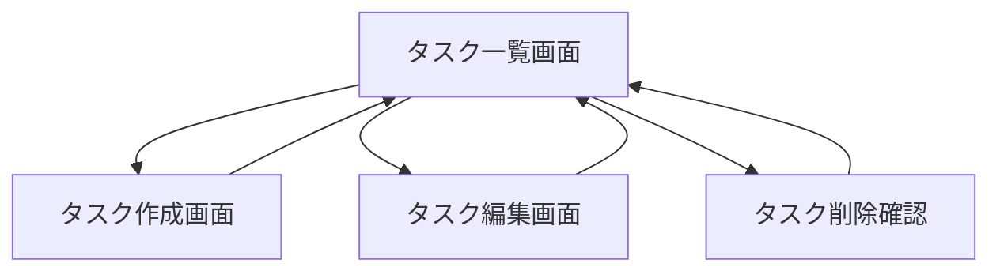

# 要件定義書

## 1. 機能要件

### 1.1 ユーザーストーリー

1. TODOタスクの基本操作
```
ユーザーとして、新しいTODOタスクを作成したい
ユーザーとして、TODOタスクの一覧を見たい
ユーザーとして、TODOタスクを完了できるようにしたい
ユーザーとして、TODOタスクを削除できるようにしたい
```

### 1.2 機能一覧

#### TODOタスク管理機能
- タスクの作成
  - タイトル（必須）
  - 説明（オプション）
  - 期限（オプション）
- タスクの表示
  - 一覧表示
  - 完了/未完了でのフィルタリング
- タスクの更新
  - 完了/未完了のステータス変更
  - タイトル、説明、期限の編集
- タスクの削除

### 1.3 画面遷移図



### 1.4 APIエンドポイント定義

#### タスク関連API
- GET /api/tasks - タスク一覧の取得
- POST /api/tasks - 新規タスクの作成
- GET /api/tasks/:id - 特定のタスクの取得
- PUT /api/tasks/:id - タスクの更新
- DELETE /api/tasks/:id - タスクの削除

### 1.5 データモデル設計

#### Task
```typescript
interface Task {
  id: string;          // タスクの一意識別子
  title: string;       // タスクのタイトル
  description?: string; // タスクの説明（オプション）
  completed: boolean;   // 完了状態
  dueDate?: Date;      // 期限（オプション）
  createdAt: Date;     // 作成日時
  updatedAt: Date;     // 更新日時
}
```

## 2. 非機能要件

### 2.1 パフォーマンス要件
- ページ初期読み込み時間: 3秒以内
- API レスポンス時間: 500ms以内
- 同時接続数: 最大10ユーザー

### 2.2 セキュリティ要件
- HTTPS通信の使用
- APIリクエストの検証
- XSS対策の実施
- CSRF対策の実施

### 2.3 可用性要件
- サービス稼働時間: 99.9%
- バックアップ: 日次
- 障害復旧時間: 2時間以内

### 2.4 スケーラビリティ要件
- 水平スケーリング可能な設計
- データベースのレプリケーション対応
- キャッシュ機構の導入