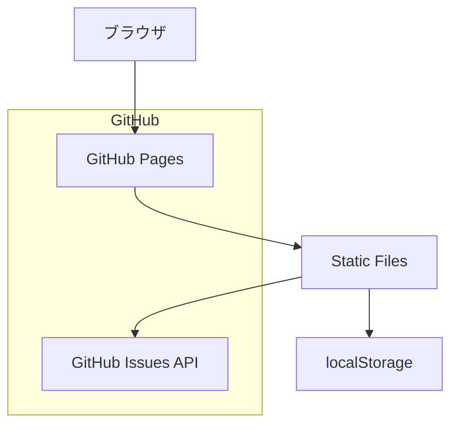

# システムアーキテクチャ

## システム構成図



## 使用技術と選定理由

### フロントエンド
- **HTML/CSS/JavaScript**
  - シンプルで保守しやすい
  - ブラウザネイティブの機能を活用
  - 追加のビルド環境が不要
  - CDNによるライブラリ利用が可能

### ホスティング
- **GitHub Pages**
  - 無料で利用可能
  - 自動デプロイが容易
  - 高い可用性
  - HTTPSサポート

### データストレージ
- **localStorage**
  - クライアントサイドでの永続化
  - オフライン対応が可能
  - シンプルなAPI

- **GitHub Issues API**（オプション）
  - バックアップ用途
  - APIトークンのみで利用可能
  - Markdownサポート

## コンポーネント構成

### フロントエンド
```
src/
├── index.html      # メインHTML
├── css/
│   └── style.css   # スタイル定義
└── js/
    ├── app.js      # メインアプリケーション
    ├── storage.js  # データ永続化
    └── ui.js       # UI操作
```

### データモデル

```javascript
// タスクモデル
interface Task {
    id: string;            // ユニークID
    title: string;         // タスクタイトル
    completed: boolean;    // 完了状態
    createdAt: string;     // 作成日時
    updatedAt: string;     // 更新日時
}
```

## APIインターフェース

### localStorage API
```javascript
// 保存
localStorage.setItem('todos', JSON.stringify(todos));

// 取得
const todos = JSON.parse(localStorage.getItem('todos')) || [];
```

### GitHub Issues API（オプション）
```javascript
// Issue作成
POST /repos/{owner}/{repo}/issues
{
    "title": "Task: Buy groceries",
    "body": "- [ ] Milk\n- [ ] Bread",
    "labels": ["todo"]
}

// Issue更新
PATCH /repos/{owner}/{repo}/issues/{issue_number}
{
    "state": "closed"
}
```

## セキュリティ考慮事項
1. クライアントサイドの制限
   - センシティブなデータは扱わない
   - XSS対策の実施

2. GitHub Issues API
   - 読み取り専用トークンの使用
   - トークンの適切な管理

## パフォーマンス最適化
1. 静的アセットの最小化
2. キャッシュの活用
3. レスポンシブ対応
4. 遅延読み込みの実装