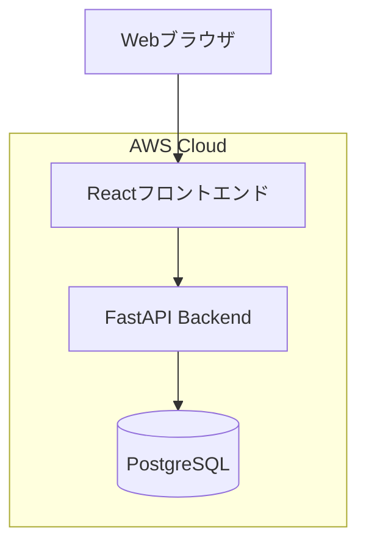

# システムアーキテクチャ

## システム構成図



## 使用技術と選定理由

### フロントエンド
- **React**: 
  - コンポーネントベースの開発による保守性の向上
  - 豊富なエコシステムとライブラリ
  - TypeScriptによる型安全性

### バックエンド
- **FastAPI**:
  - 高速なパフォーマンス
  - OpenAPI（Swagger）による自動ドキュメント生成
  - Pythonの非同期サポート
  - 型ヒントによる開発効率の向上

### データベース
- **PostgreSQL**:
  - 信頼性と拡張性
  - JSONBデータ型のサポート
  - 豊富なインデックスオプション

## コンポーネント間の関係

### フロントエンド構成
- **状態管理**: Redux Toolkit
- **ルーティング**: React Router
- **UIライブラリ**: Material-UI
- **APIクライアント**: Axios

### バックエンド構成
- **認証**: JWT
- **ORM**: SQLAlchemy
- **マイグレーション**: Alembic
- **テスト**: pytest

## API設計概要

### RESTful API
- エンドポイントは`/api/v1/`をプレフィックスとする
- リソースベースのURL設計
- HTTPメソッドの適切な使用

### GraphQL API
- `/graphql`エンドポイントで提供
- N+1問題を考慮したリゾルバー設計

## データモデル

### タスクモデル
```typescript
interface Task {
  id: string;
  title: string;
  description: string;
  status: 'TODO' | 'IN_PROGRESS' | 'DONE';
  dueDate: Date;
  priority: 'LOW' | 'MEDIUM' | 'HIGH';
  tags: string[];
  createdAt: Date;
  updatedAt: Date;
  userId: string;
}
```

### ユーザーモデル
```typescript
interface User {
  id: string;
  email: string;
  name: string;
  preferences: {
    theme: 'light' | 'dark';
    notifications: boolean;
  };
  createdAt: Date;
  updatedAt: Date;
}
```